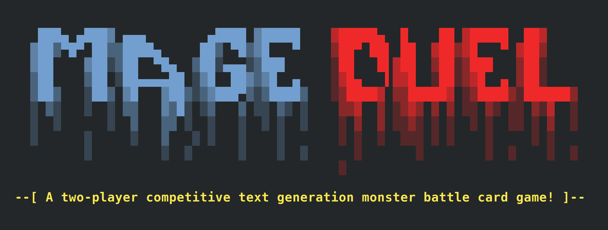

# MageDuel

## What is this?

A very simple, two-player competitive text generation monster battle card game!

## Q&A

* **How can I play this?**

  You will need access to some large language model API, like OpenAI's GPT-3. You can get free trial access there. Or you could sign up for AI21's beta and try the jurassic-jumbo model there. If you have an account for one of them and an API key, you are ready to go.

* **How is this a "text generation game"?**

  First, the only action of the player is to form a monster name using prefixes, creature names and suffixes. Putting words together in context to build something bigger is basically text generation.

  Second, essential parts of this game, the description of the summoned creatures and the battle report are generated by a large language model (such as the GPT-3) individually and on the fly for every new battle. Actually, there is not a single line of code in this game defining the logic of the battle or the monster characteristics. It's all in the knowledge of the language model and a few example reports.

  Finally, generating text with large language models often yields unexpected results, to the good and to the bad. While this is a challenge for a lot of serious applications, this aspect is simply turned into a game here.

* **What is a large language model?**

  A large language model is a statistical model that can for example predict given a sequence of input words, the next most likely words to come, i.e. a probable continuation of that sequence. Just like the word suggestions on your smartphone keyboard. It is called a 'large' language model, because it has 'read' a tremendous amount of text and has a lot of memory to memorize things and can thus build quite reliant statistics about words and the contexts they are used in.

* **How can the language model decide on my creatures characteristics and how the battle goes?**

  The monster characteristics and the battle reports are 'just' more or less probable continuations of a sequence of words. If the monster name is "mutant ninja turtle (hungry)" and the next thing to come is a character description, the model will choose likely words and formulations to continue the text and thus in effect generate a character description of a hungry, mutant ninja turtle, hopefully a fitting and entertaining one. The same applies for the generated battle report. The only input to the model are a few example game texts, so that it has seen the contexts and the structure of the text, and the monster names given by the player.

* **So the game sends requests to those large language model APIs, which might cost money!?! How much will I have to pay for one game?**

  For OpenAI, one battle round consumes approximately 1600 tokens, so $0.10 for the biggest and most expensive `davinci` model. A game is about 5 rounds. But remember that you have $18 for free in the trial. For AI21, you can consume 10k tokens per day for free for the biggest `jumbo` model in the beta.

* **Can I play this without relying on some hosted, maybe even paid API?**

  Yes, instead of using a hosted API, you could try to run one of the language models locally on your machine. But typically they are really big and only run on some cluster of specialized machines. You could try to run a 'smaller' free model, GPT-J, on your machine. But it will still require something like a GTX 3090 to fit into memory... and the calculation will take a few seconds. Choosing smaller models, however, is just not as much fun oftentimes, since the generated texts are less coherent and the model might not have 'read and memorized' enough nerdy internet content to be able to properly describe some weird creature and its fighting behaviour.

* **Seriously, there is no graphics in this game, but I need a 1000€ graphics card to run this?**

  Yes. :) Language models are large statistical models that require a lot of computation. First of all, you'd want to do this on hardware that can compute floating-numbers very efficiently and that typically is the GPU in consumer computers. Second, the models are large, so they need a lot of space when being held in memory and cheap cards don't have that much memory. Finally, because they are quite complex and consist of various layers that all need to be computed, you'd want to have some decent card. 

* **This is cool!**

  To be fair, there are way more complex and elaborate text generation based games, like AI Dungeon to name just one. But I'm happy to hear, you like this tiny game. :)

* **Why the hell did you build this?**

  I enjoyed playing MUDs ('multi-user dungeons') and other text-based computer RPG games. Also, I wanted to know a dwarven babysitter would do against an overexcited dragon newborn. ;)
